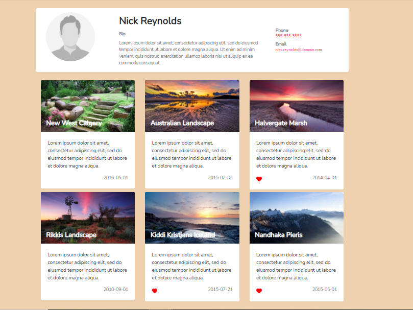
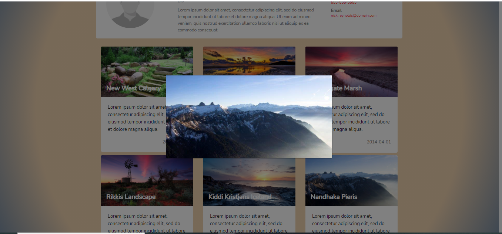

## Images 

## Tools used
To make this project I used the following tools 

For Backend
- Mysql Database.
- Php Laravel. 
- Postman to make some calls and check during the development.

For the front end 
- Vue.js. 
- Bootstrap for the responsivines and UI. 
- Css to buid the style. 
- To make the gradient I used an online gradient tool and used it for the background.
- To make the ajax call I made used of axios library

## Development of backend

First I associate the author with the existing user tables in laravel, I chose to do it this way so that they could register in the future and upload their on data. I also created a table for the photos and included a foreign key to the user 

Second I made a seeder class which consist on adding the example data inside my tables.

Third, I created the user and photo model and the association inside user so I can easily call the photos of an user.

Four, I created and entry point for my backend to provide the demanded json data. I tested it using postman and the browser.  

## Front-end Development

First, I stated out building a html- bootstrap structure similar to the wireframe. I did at the begining in a component to later decouple it. I made used of axios to get the data an display information in my component.

Second, I polished the styles to make it as similar to the wirefrime as I could using bootstrap and css. 

Third, once I had my page looking good and with the requested data from the backedn then I started working on decoupling it into components. I created two more components that could be reusable in the future. One for the bio information ( avat, name , description, phone etc) and other for the cards to display the image, date, description etc.

these components get props from the parent components (profile component) and thats how they display the information. the main component receives form a prop the id of the used to display. right now it uses id 1 but that could change in the future. 

## Extra

I made a litle trick when an image is clicked it launches a bootstrap modal and places the full image in it.

## Others thoughts 
I think this porject is really cool and has endless way to be improved. I thought of adding arrows and displaying other images in the modal, I tried to achieved that but was short on time. I also considered adding a different layout in which the images were wider one next to the other if the had different sizes it could be a Masonry layout etc.

## Settings

clone repo. 

access client folder y execute  `npm install`. once finish run  `npm watch`  

on main folder run 
`composer install`. 
`cp .env.example .env`.  set your environment variables 
`php artisan key:generate`
`php artisan migrate `

`php artisan db:seed `

then start serving  `php artisan serve` 

Go to http://127.0.0.1:8000/

